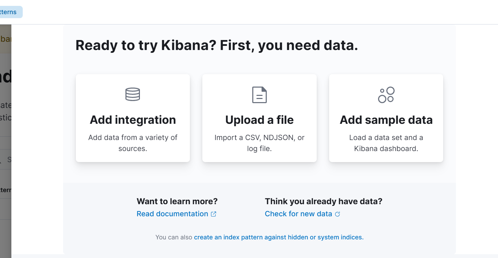
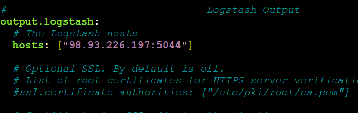
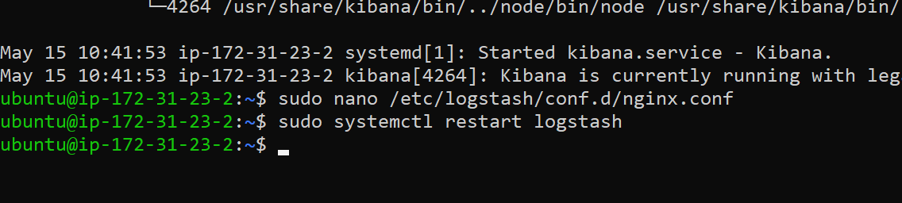
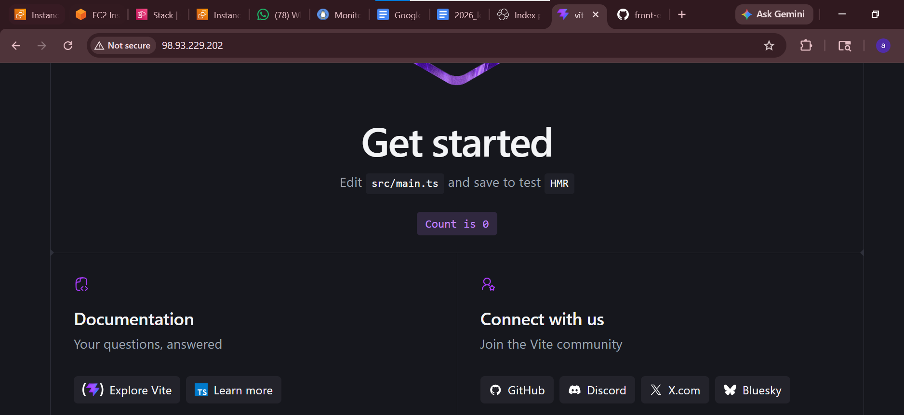
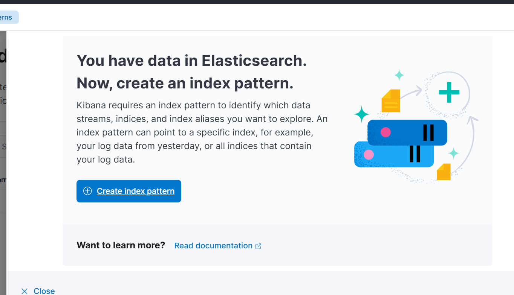
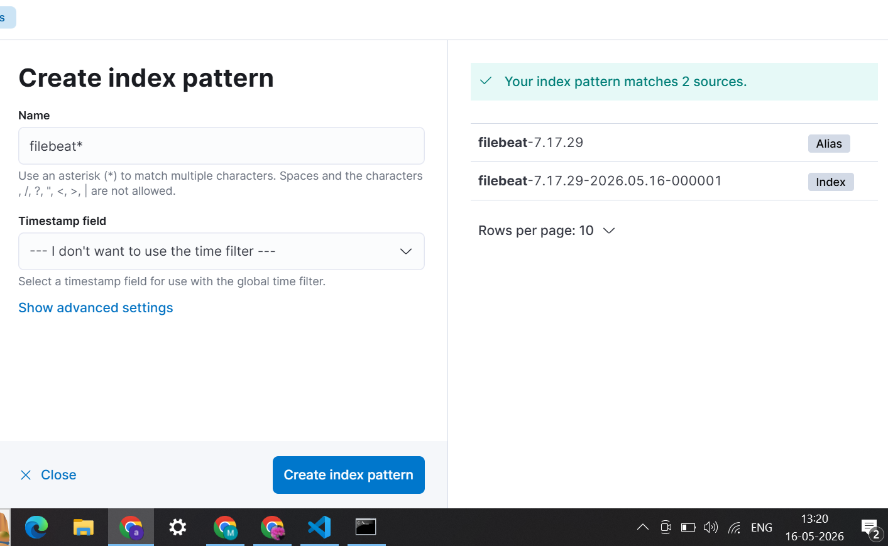
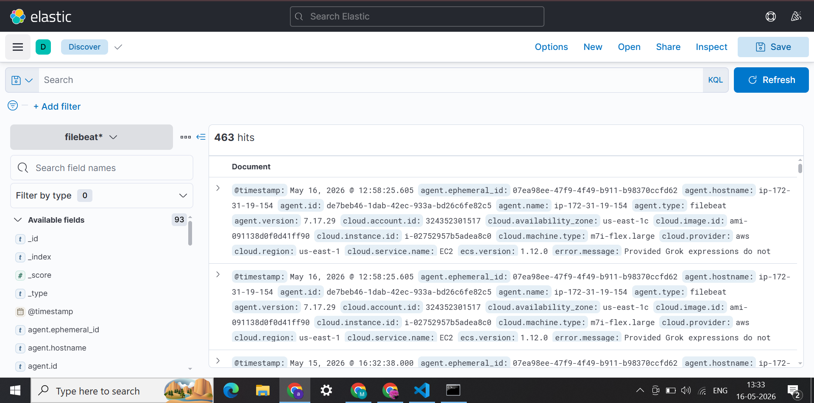
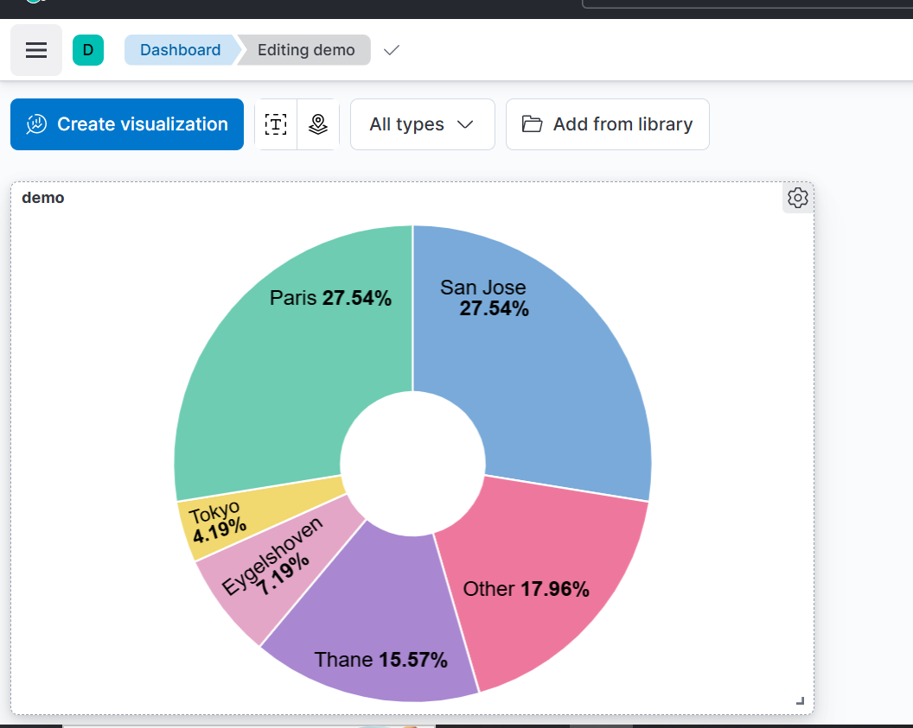

# ELK Stack Setup on AWS

This will guide you to install ELK stack on EC2 and Also collect logs and show in kibana


The ELK Stack consists of:
- Elasticsearch → Stores and indexes logs.
- Logstash → Processes and transforms logs before storing them in Elasticsearch.
- Kibana → Provides visualization and analysis of logs.
- Filebeat → Forwards logs from the application to Logstash.

We are using Two EC2 Ubuntu machines:
1. ELK → Hosts Elasticsearch, Logstash, Kibana.
2. Server → Hosts Node application and Filebeat.

## Pre-Requisites

### Launch 2 Ubuntu EC2 instance with t2.medium type 

- Name 1st Ubuntu Machine as "ELK"
- Name 2nd Ubuntu machine as "Server"


## On ELK Machine

#### Step 1: Install & Configure Elasticsearch (ELK)

- Step 1.1: Install Java (Required for Elasticsearch & Logstash)
```
sudo apt update && sudo apt install openjdk-21-jre-headless -y
```
- Step 1.2: Install Elasticsearch

```
# Step 1: Download and save the Elasticsearch GPG key
sudo mkdir -p /etc/apt/keyrings
curl -fsSL https://artifacts.elastic.co/GPG-KEY-elasticsearch | gpg --dearmor | sudo tee /etc/apt/keyrings/elastic.gpg > /dev/null

# Step 2: Add the Elasticsearch APT repository
echo "deb [signed-by=/etc/apt/keyrings/elastic.gpg] https://artifacts.elastic.co/packages/7.x/apt stable main" | sudo tee /etc/apt/sources.list.d/elastic-7.x.list

# Step 3: Update package index
sudo apt update

# Step 4: Install Elasticsearch
sudo apt install elasticsearch -y

```

- Step 1.3: Configure Elasticsearch

```
sudo nano /etc/elasticsearch/elasticsearch.yml
```
Add below lines and save
```
network.host: 0.0.0.0
cluster.name: my-cluster
node.name: node-1
discovery.type: single-node
```

- Step 1.4: Start & Enable Elasticsearch

```
sudo systemctl start elasticsearch

sudo systemctl enable elasticsearch

sudo systemctl status elasticsearch
```
- Step 1.5: Verify Elasticsearch

```
curl -X GET "http://localhost:9200"
```

#### Step 2: Install & Configure Logstash (ELK) 

- Step 2.1: Install Logstash

```
sudo apt install logstash -y
```

- Step 2.2: Configure Logstash to Accept Logs

```
sudo nano /etc/logstash/conf.d/logstash.conf
```
Add the below lines and save

```
input {
 beats {
 port => 5044
 }
}
filter {
 grok {
 match => { "message" => "%{TIMESTAMP_ISO8601:log_timestamp} %{LOGLEVEL:log_level}
%{GREEDYDATA:log_message}" }
 }
}
output {
 elasticsearch {
 hosts => ["http://localhost:9200"]
 index => "logs-%{+YYYY.MM.dd}"
 }
 stdout { codec => rubydebug }
}
```

- Step 2.3: Start & Enable Logstash

```
sudo systemctl start logstash

sudo systemctl enable logstash

sudo systemctl status logstash
```
- Step 2.4: Allow Traffic on port 5044

```
sudo ufw allow 5044/tcp
```

#### Step 3: Install & Configure Kibana (ELK)

- Step 3.1: Install Kibana
```
sudo apt install kibana -y
```

- Step 3.2: Configure Kibana

```
sudo vi /etc/kibana/kibana.yml
```
Modify the below content
```
server.host: "0.0.0.0"
elasticsearch.hosts: ["http://localhost:9200"]
```

- Step 3.3: Start & Enable Kibana

```
sudo systemctl start kibana

sudo systemctl enable kibana

sudo systemctl status kibana
```

- Step 3.4: Allow Traffic on Port 5601

```
sudo ufw allow 5601/tcp
```

- Step 3.5: Access Kibana Dashboard

##### Open a browser and go to: http://<ELK_Server_Public_IP>:5601
go the --- andselect the discover 


on our server we are going to install the server and run the application 
connect the appilcation server 


#### Step 4: Install & Configure Filebeat (application server )

- Step 4.1: Install Filebeat

```
# Create keyrings directory if it doesn't exist
sudo mkdir -p /etc/apt/keyrings

# Import the Elastic GPG key securely
curl -fsSL https://artifacts.elastic.co/GPG-KEY-elasticsearch | gpg --dearmor | sudo tee /etc/apt/keyrings/elastic.gpg > /dev/null

# Add the APT repository (7.x version)
echo "deb [signed-by=/etc/apt/keyrings/elastic.gpg] https://artifacts.elastic.co/packages/7.x/apt stable main" | sudo tee /etc/apt/sources.list.d/elastic-7.x.list

# Update the package list
sudo apt update

# Install Filebeat
sudo apt install filebeat -y

```

- Step 4.2: Install Nginx, NPM, NodeJs

```
sudo apt install -y nodejs npm nginx
```

- Step 4.3: Configure Filebeat nginx module to handle Nginx logs

```
sudo filebeat modules enable nginx

sudo nano /etc/filebeat/modules.d/nginx.yml

```
Modify below lines and save the file
```
- module: nginx
  access:
    enabled: true
    var.paths: ["/var/log/nginx/access.log*"]

```
- Step 4.4: Edit Filebeat output to send data to Logstash

```
sudo nano /etc/filebeat/filebeat.yml
```

Find and comment out the output.elasticsearch section and replace:

```
output.logstash:
  hosts: ["<LOGSTASH_IP>:5044"]

```
- Step 4.5: Ensure Logstash is listening on port 5044 (ELK)

```
do this in the ELK server 
sudo nano /etc/logstash/conf.d/logstash.conf
```

Paste these lines and save:
```
input {
  beats {
    port => 5044
  }
}

filter {
  if [fileset][module] == "nginx" {
    if [fileset][name] == "access" {
      grok {
        match => { "message" => "%{COMBINEDAPACHELOG}" }
      }
      date {
        match => [ "timestamp" , "dd/MMM/yyyy:HH:mm:ss Z" ]
      }
    }
    else if [fileset][name] == "error" {
      grok {
        match => { "message" => "\[%{HTTPDATE:timestamp}\] \[%{LOGLEVEL:loglevel}\] %{GREEDYDATA:message}" }
      }
      date {
        match => [ "timestamp" , "dd/MMM/yyyy:HH:mm:ss Z" ]
      }
    }
  }
}

output {
  stdout { codec => rubydebug}
  # elasticsearch {
  # hosts => ["http://localhost:9200"]
  # ndex => "nginx-logs-%{+YYYY.MM.dd}"
  #}
  
}

```

- Step 4.6: Restart Logstash:
```
sudo systemctl restart logstash
```


now do this in your application server 
- Step 4.7: Start and Enable filebeat

```
sudo systemctl enable filebeat

sudo systemctl start filebeat

sudo systemctl status filebeat
```

#### Step 5: Deploy Node Application (Server)


- Step 5.1: Create a Vite Boiler Plate project

```
npm create vite@latest
```

- Step 5.2: Install Dependencies
```
cd project-folder

npm install
```
- Step 5.3: Build the project

```
npm run build
```

Step 5.4: Copy Dist Folder files to Nginx server location

```
cd dist

sudo cp * -r /var/www/html
```

- Step 5.5: Access the node app in browser on port 8080 with public ip of server machine

now you can access your website 



#### Step 6: View & Analyze Logs in Kibana

- Step 6.1: Access Kibana on Web Browser

Open a browser and go to:
do it from here 
http://<ELK_Server_Public_IP>:5601

-----------------------------------
Pull requests are welcome. For major changes, please open an issue first
to discuss what you would like to change.

click on index pattern


go to again on 3 lines and again clikc on discover 
here it will show you how many times it got clicked 



if your click on any of the data  then you can see the visualizes 

and your are done delete everything!!


