# Monitoring AWS EKS Using Grafana and Prometheus

## Prerequisites

* AWS Account
* Ubuntu EC2 Instance
* EKS
* Helm Charts
* Grafana
* Prometheus

---

# Step 1: Launch an Ubuntu EC2 Instance

Launch an Ubuntu EC2 instance with:

* Instance Type: `t2.medium` or `t2.large`
* Attach an IAM Role with `AdministratorAccess`

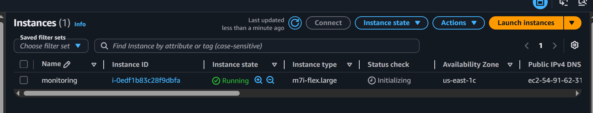
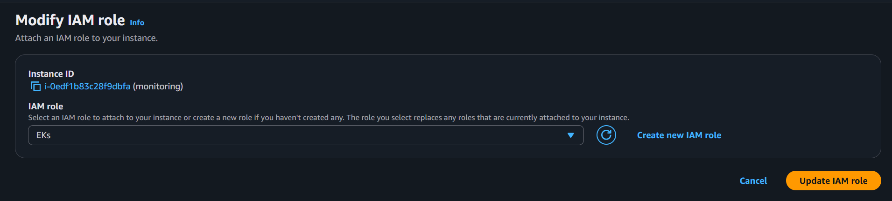
After launching, connect to the server using SSH.

---

# Step 2: Update the Server

```bash
sudo apt update
```

Install required packages:

```bash
sudo apt install awscli unzip -y
```

Verify AWS CLI:

```bash
aws --version
```

---

# Step 3: Attach IAM Role

Create an IAM Role with:

* `AdministratorAccess`

Attach the IAM Role to your EC2 instance.

Verify access:

```bash
aws s3 ls
```

If buckets are listed successfully, IAM permissions are working.

---

# Step 4: Install Docker, kubectl, eksctl, and Helm

## Update Packages

```bash
sudo apt-get update -y && sudo apt-get upgrade -y
```

---

## Install Docker

```bash
sudo apt-get install -y docker.io
sudo systemctl start docker
sudo systemctl enable docker
sudo usermod -aG docker ubuntu
newgrp docker
```

Verify Docker:

```bash
docker --version
```

Expected Output:

```bash
Docker version 24.x.x
```

---

## Install AWS CLI v2

```bash
curl "https://awscli.amazonaws.com/awscli-exe-linux-x86_64.zip" -o "awscliv2.zip"

sudo apt-get install -y unzip

unzip awscliv2.zip

sudo ./aws/install
```

Verify:

```bash
aws --version
```

Expected Output:

```bash
aws-cli/2.x.x
```

---

## Install kubectl

```bash
curl -LO "https://dl.k8s.io/release/$(curl -sL https://dl.k8s.io/release/stable.txt)/bin/linux/amd64/kubectl"

sudo install -o root -g root -m 0755 kubectl /usr/local/bin/kubectl
```

Verify:

```bash
kubectl version --client
```

Expected Output:

```bash
Client Version: v1.29.x
```

---

## Install eksctl

```bash
ARCH=amd64

PLATFORM=$(uname -s)_$ARCH

curl -sLO "https://github.com/eksctl-io/eksctl/releases/latest/download/eksctl_$PLATFORM.tar.gz"

tar -xzf eksctl_$PLATFORM.tar.gz -C /tmp

sudo mv /tmp/eksctl /usr/local/bin
```

Verify:

```bash
eksctl version
```

Expected Output:

```bash
0.18x.x
```

---

## Install Helm

```bash
curl https://raw.githubusercontent.com/helm/helm/main/scripts/get-helm-3 | bash
```

Verify:

```bash
helm version
```

Expected Output:

```bash
version.BuildInfo{Version:"v3.x.x"...}
```

---

# Step 5: Verify All Installations

```bash
kubectl version

aws --version

docker ps

eksctl version

helm version
```
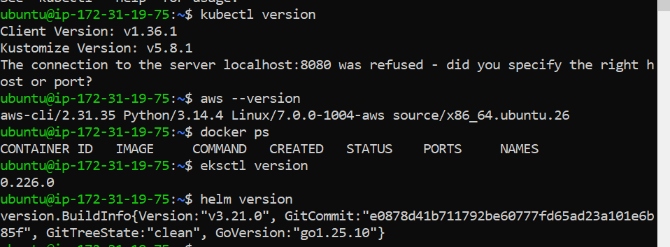
---

# Step 6: Create an EKS Cluster

Run the following command:

```bash
eksctl create cluster \
--name my-cluster \
--region us-east-1 \
--version 1.34 \
--nodegroup-name mynode \
--node-type=m7i-flex.large \
--managed \
--nodes=2 \
--nodes-min=2 \
--nodes-max=3 \
--asg-access
```

---

# Step 7: Verify the Cluster

List the cluster:

```bash
eksctl get cluster --name my-cluster --region us-east-1
```

Update kubeconfig:

```bash
aws eks update-kubeconfig --name my-cluster --region us-east-1
```

Verify nodes:

```bash
kubectl get nodes
```

Verify namespaces:

```bash
kubectl get ns
```

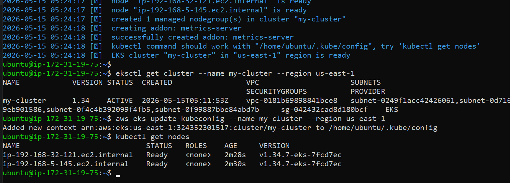
---

# Step 8: Add Helm Repositories

Add Stable Charts Repository:

```bash
helm repo add stable https://charts.helm.sh/stable
```

Add Prometheus Community Repository:

```bash
helm repo add prometheus-community https://prometheus-community.github.io/helm-charts
```

Update Helm repositories:

```bash
helm repo update
```

---

# Step 9: Create Monitoring Namespace

```bash
kubectl create namespace monitoring
```

Verify:

```bash
kubectl get ns
```

---

# Step 10: Install Prometheus and Grafana

Install kube-prometheus-stack using Helm:

```bash
helm install stable prometheus-community/kube-prometheus-stack --namespace monitoring
```

Verify pods:

```bash
kubectl get pods -n monitoring
```

Wait until all pods are in `Running` state.
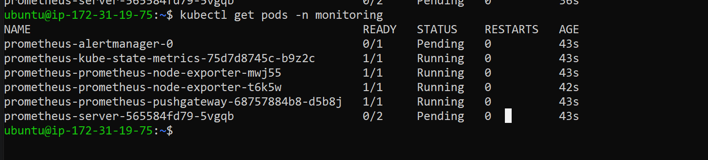

---

# Step 11: Expose Prometheus Using LoadBalancer

Check services:

```bash
kubectl get svc -n monitoring
```

Edit Prometheus service:

```bash
kubectl edit svc stable-kube-prometheus-sta-prometheus -n monitoring
```

Change:

```yaml
type: ClusterIP
```

to:

```yaml
type: LoadBalancer
```

Save and exit.
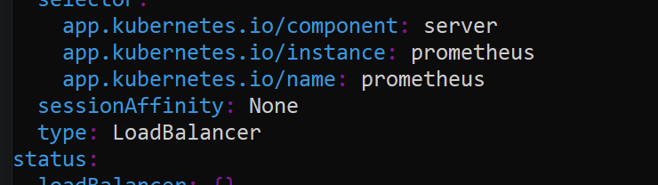
Verify again:

```bash
kubectl get svc -n monitoring
```

You will now see an external LoadBalancer DNS.

Access Prometheus in browser:

```bash
http://<LOADBALANCER-DNS>:9090
```

---

# Step 12: Update Security Group

Open port `9090` in the LoadBalancer Security Group.

After allowing the port, Prometheus will be accessible publicly.

---

# Step 13: Expose Grafana Using LoadBalancer

Check services:

```bash
kubectl get svc -n monitoring
```

Edit Grafana service:

```bash
kubectl edit svc stable-grafana -n monitoring
```

Change:

```yaml
type: ClusterIP
```

to:

```yaml
type: LoadBalancer
```

Save and exit.

Verify:

```bash
kubectl get svc -n monitoring
```

You will now see the external LoadBalancer DNS for Grafana.

Access Grafana:

```bash
http://<LOADBALANCER-DNS>
```
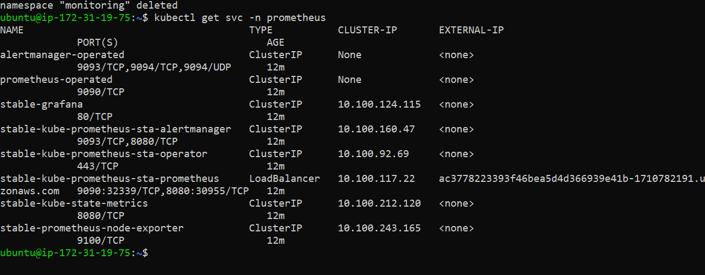
---

# Step 14: Get Grafana Admin Password

Run the following command:

```bash
kubectl get secret --namespace monitoring stable-grafana -o jsonpath="{.data.admin-password}" | base64 --decode ; echo
```

Default Username:

```bash
admin
```

Use the decoded password to log in.

---

# Step 15: Deploy the Netflix Application

Deploy the application:

```bash
kubectl apply -f deploy.yml
```

Verify deployment:

```bash
kubectl get all -n netflix-app
```

You will see:

* Deployment
* Pods
* Service
* LoadBalancer

---

# Step 16: Verify Application Logs

Check pod logs:

```bash
kubectl logs pod/netflix-deployment-7ddd668d-75lvg -n netflix-app
```
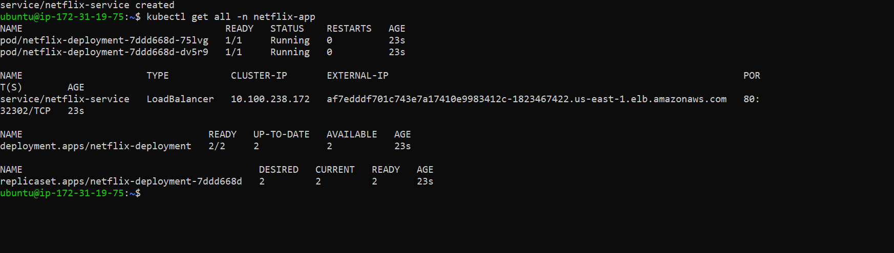
---

# Step 17: Monitor Application in Grafana

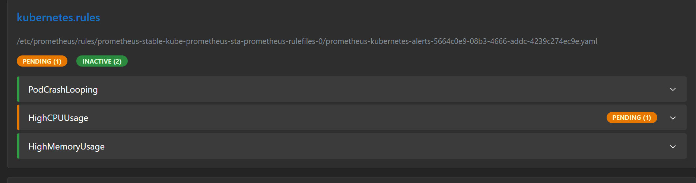

now its firring 
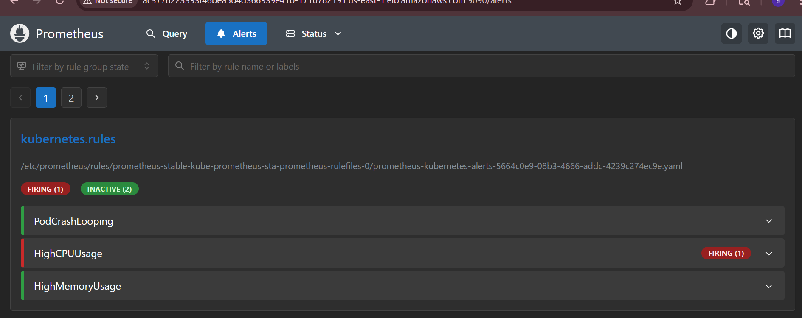

you will get the mail for CPU usage 
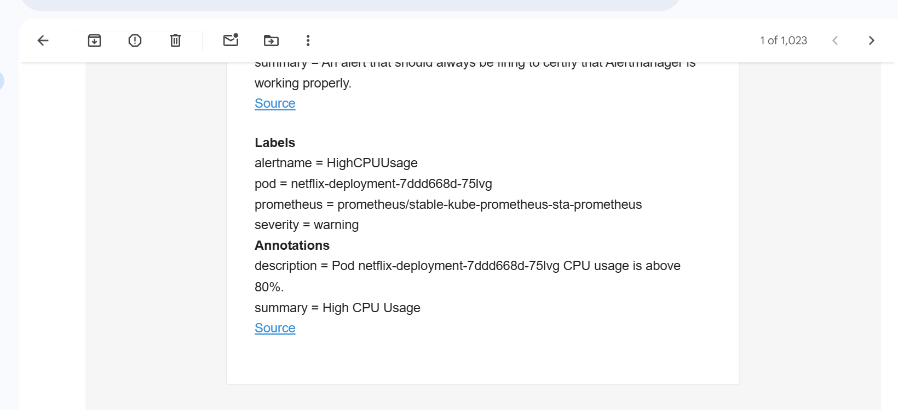
and its done 
