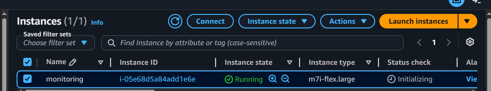
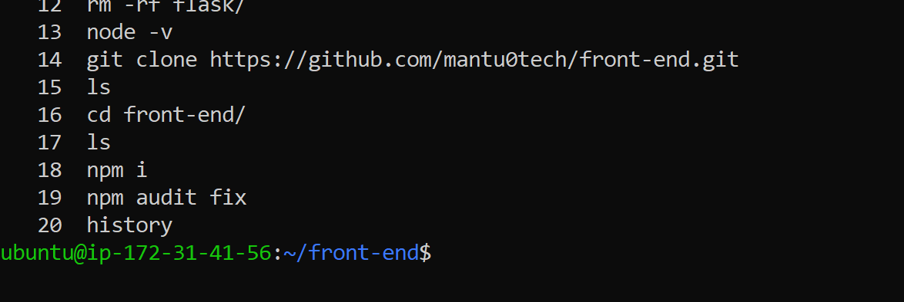
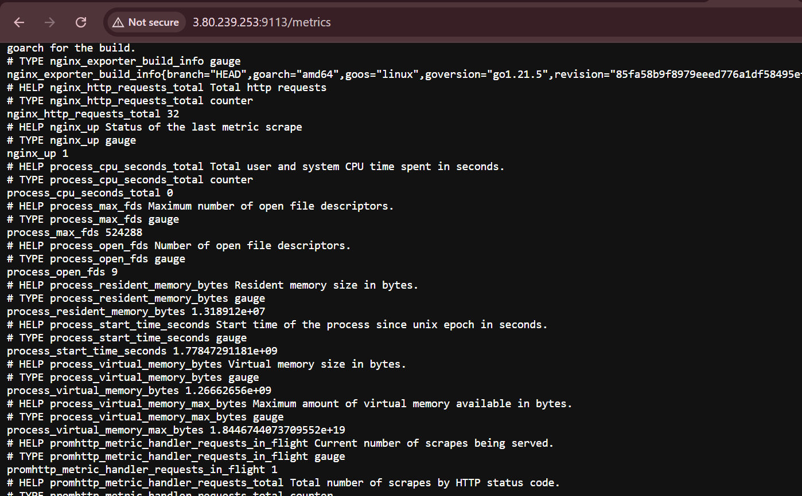
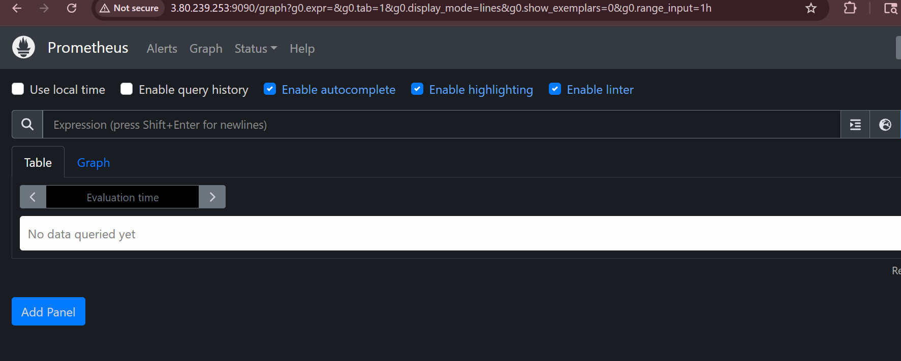
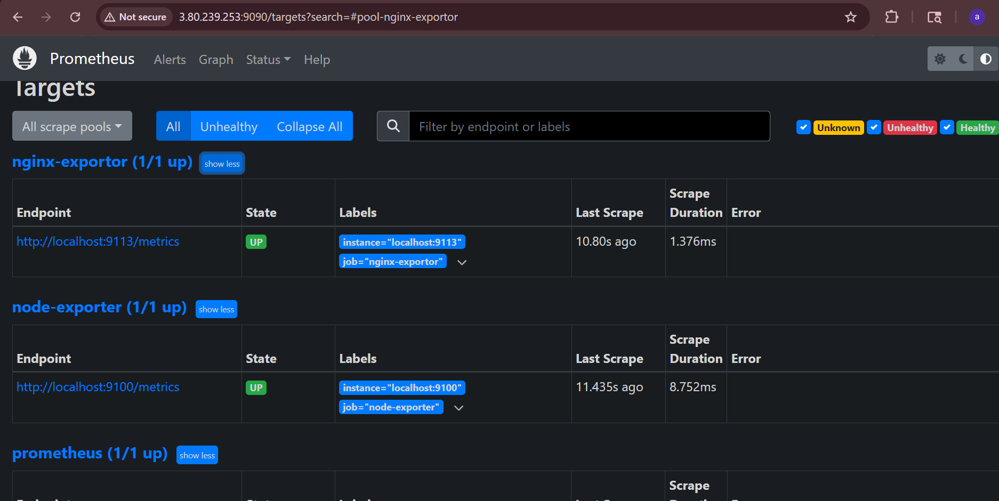
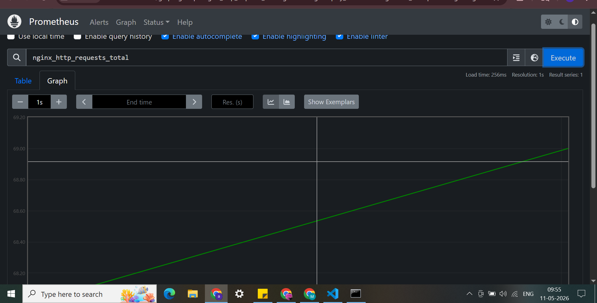
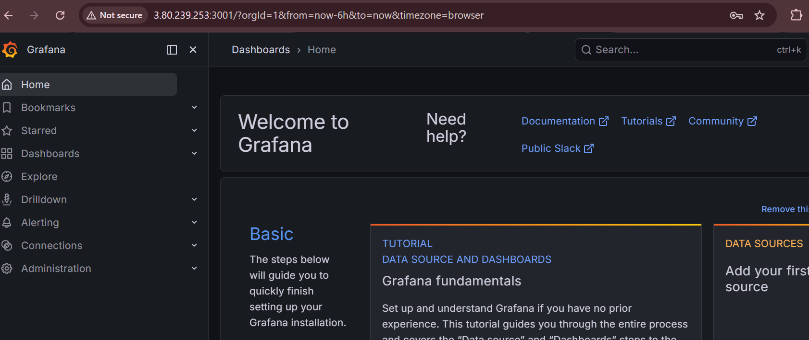
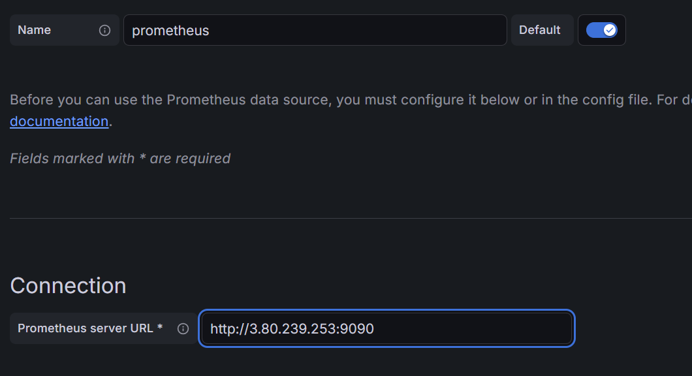
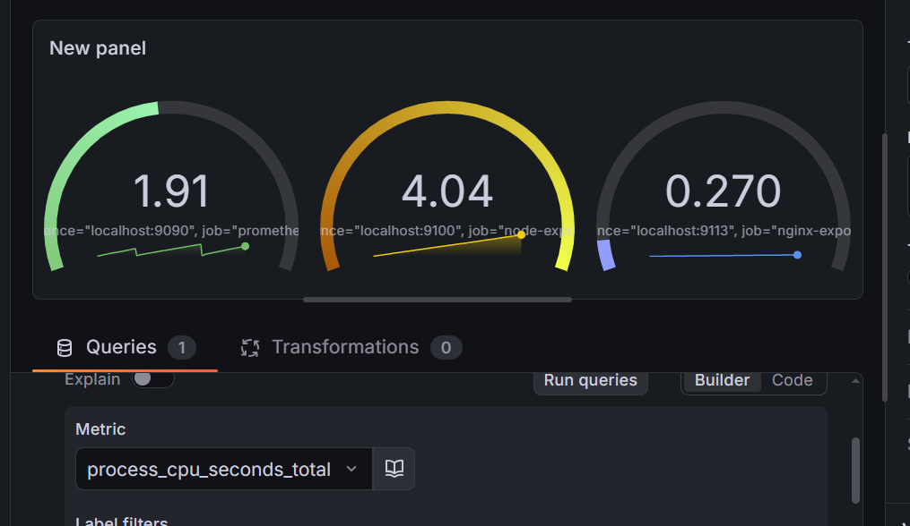

# Practical 1: Install Prometheus + Grafana on AWS EC2 and Monitor a Node.js Application

This practical is designed so you can complete it within **1 hour**.

You will learn:

* Launch AWS EC2 instance
* Install Prometheus
* Install Grafana
* Run Node.js application
* Monitor application metrics
* Integrate Grafana with Prometheus
* Create custom Grafana dashboards
* Use basic PromQL queries

---


# Architecture

```text
Node.js App  --->  Prometheus  --->  Grafana
   :3000            :9090          :3000
```

---

# Step 1: Create AWS EC2 Instance

Go to:



## EC2 Configuration

* OS: Ubuntu Server 22.04
* Instance Type: t2.micro
* Storage: 8 GB
* Key Pair: Create/download PEM file

## Security Group

Allow these ports:

| Port | Purpose    |
| ---- | ---------- |
| 22   | SSH        |
| 3000 | Node App   |
| 9090 | Prometheus |
| 3001 | Grafana    |

---

# Step 2: Connect to EC2

Open terminal.

```bash
chmod 400 your-key.pem
```

```bash
ssh -i your-key.pem ubuntu@YOUR_PUBLIC_IP
```

---

# Step 3: Update Server

```bash
sudo apt update -y
sudo apt upgrade -y
```

---

# Step 4: Install Node.js

```bash
sudo apt install nodejs npm -y
```

Verify:

```bash
node -v
npm -v
```

---


# Step 5: Run Your Node.js Application

Move your application files to server.

Example:

```bash
mkdir app
cd app
```

Create sample app:

```bash
nano app.js
```
git clone https://github.com/mantu0tech/front-end.git

# Step 6: Install Dependencies

```bash
npm install 
```

# Step 7: Start Application

OR run in background:

```bash
nohup npm start  &
```

---

# Step 8: Access Application

Open browser:

```text
http://YOUR_PUBLIC_IP:3000
```


Metrics endpoint:

```text
http://YOUR_PUBLIC_IP:3000/metrics
```
# Step 9: TO run your application on port 80 

install nginx 
sudo apt update
sudo apt install nginx -y

sudo systemctl start nginx
sudo systemctl enable nginx

Edit config:

sudo nano /etc/nginx/sites-available/default

Replace everything with:

server {
    listen 80;

    location / {
        proxy_pass http://localhost:3000;
    }

    location /nginx_status {
        stub_status;
        allow 127.0.0.1;
        allow YOUR_PUBLIC_IP;
        deny all;
    }
}
Test Config
sudo nginx -t

Restart nginx:

sudo systemctl restart nginx

now access the website using your ip 

---

# Step 9: Install Prometheus

```bash
cd /tmp
```

Download:

```bash
wget https://github.com/prometheus/prometheus/releases/download/v2.53.0/prometheus-2.53.0.linux-amd64.tar.gz
```

Extract:

```bash
tar xvf prometheus-2.53.0.linux-amd64.tar.gz
```

Move:

```bash
sudo mv prometheus-2.53.0.linux-amd64 /opt/prometheus
```

---

# Step 10: install Node Exporter 
```bash
cd /tmp

wget https://github.com/prometheus/node_exporter/releases/download/v1.8.1/node_exporter-1.8.1.linux-amd64.tar.gz

tar xvf node_exporter-1.8.1.linux-amd64.tar.gz

sudo mv node_exporter-1.8.1.linux-amd64 /opt/node_exporter
```

Start exporter:

cd /opt/node_exporter
nohup ./node_exporter &


Open config:

```bash
sudo nano /opt/prometheus/prometheus.yml
```

Replace with:

```yaml
global:
  scrape_interval: 5s

scrape_configs:
  - job_name: "nodejs-app"
    static_configs:
      - targets: ["localhost:9100"]
```
# Step 10: install nginx Prometheus Exporter

Download exporter:

cd /tmp
wget https://github.com/nginxinc/nginx-prometheus-exporter/releases/download/v1.1.0/nginx-prometheus-exporter_1.1.0_linux_amd64.tar.gz

Extract:
tar xvf nginx-prometheus-exporter_1.1.0_linux_amd64.tar.gz

Move binary:

sudo mv nginx-prometheus-exporter /usr/local/bin/
Step 7: Start Exporter
nginx-prometheus-exporter \
-nginx.scrape-uri=http://localhost/nginx_status &

now add  port 9113 to your sg 

and here your can check the metrics s

---
# Step 10: Add Exporter to Prometheus

Edit config:

sudo nano /opt/prometheus/prometheus.yml

Add:

  - job_name: "node--exporter"
    static_configs:
      - targets: ["localhost:9100"]

    - job_name: "nginx-exporter"
    static_configs:
      - targets: ["localhost:9113"]    
# Step 11: Start Prometheus

```bash
cd /opt/prometheus
```
Run in background:

```bash
if running kill it 
pkill prometheus
nohup ./prometheus --config.file=prometheus.yml &
```

---

# Step 12: Access Prometheus

Browser:

```text
http://YOUR_PUBLIC_IP:9090
```

---


now lets check the targets is there or not 
here you can see your node or nginx exportor 
ip:9090/targets

# Step 13: Test Metrics in Prometheus

Go to:

```text
Graph → Execute
```

Try query:

```promql
nginx_http_requests_total
```


You should see values increasing.

---

# Step 14: Install Grafana
https://grafana.com/docs/grafana/latest/setup-grafana/installation/debian/
refer these website to install grafana 

Install prerequisites:

```bash
sudo apt-get install -y apt-transport-https wget gnupg
```

Add Grafana key:

```bash
sudo mkdir -p /etc/apt/keyrings
sudo wget -O /etc/apt/keyrings/grafana.asc https://apt.grafana.com/gpg-full.key
sudo chmod 644 /etc/apt/keyrings/grafana.asc
```

Add repository:

```bash
echo "deb [signed-by=/etc/apt/keyrings/grafana.asc] https://apt.grafana.com stable main" | sudo tee -a /etc/apt/sources.list.d/grafana.list

echo "deb [signed-by=/etc/apt/keyrings/grafana.asc] https://apt.grafana.com beta main" | sudo tee -a /etc/apt/sources.list.d/grafana.list
```

Install:

```bash
sudo apt update
sudo apt install grafana -y
```

Start service:

```bash
sudo systemctl start grafana-server
```

Enable service:

```bash
sudo systemctl enable grafana-server
```

---

# Step 15: Access Grafana

Open:

```text
http://YOUR_PUBLIC_IP:3001
```

If not opening:

Edit Grafana port.

```bash
sudo nano /etc/grafana/grafana.ini
```

Find:

```ini
;http_port = 3000
```

Change:

```ini
if ; is there kindly remove it 
http_port = 3001
```

Restart:

```bash
sudo systemctl restart grafana-server
```

---

# Step 16: Login to Grafana

Default credentials:

```text
Username: admin
Password: admin
```

Set new password.

---

# Step 17: Integrate Grafana with Prometheus

Go to:

```text
Connections → Data Sources → Add Data Source
```

Select:

```text
Prometheus
```

URL:

```text
http://localhost:9090
```

Click:

```text
Save & Test
```

You should see:

```text
Data source is working
```

---

# Step 18: Create Custom Dashboard

Go to:

```text
Dashboards → New Dashboard
```

Click:

```text
Add Visualization
```

Select Prometheus.

---

# Step 19: Add PromQL Queries

## Total Requests

```promql
nginx_http_requests_total
```

---

---

## CPU Usage

```promql
process_cpu_seconds_total
```

---

## Memory Usage

```promql
process_resident_memory_bytes
```

---

## App Uptime

```promql
process_start_time_seconds
```

---

# Step 20: Customize Dashboard

Change:

* Panel title
* Graph type
* Time range
* Refresh interval

Example:

```text
Refresh every 5s
```
and you are done 

jsut import the dashbaord for node and nginx 


icase your forgot your grafana  password 
 sudo grafana cli admin reset-admin-password Admin@123
 