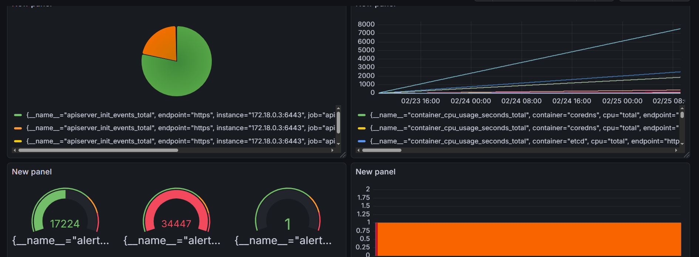

🚀 Kubernetes Observability Project
Deploy & Monitor Kubernetes Application using Prometheus & Grafana
📌 Project Overview

In this project, we:

Deploy a Kubernetes voting application on a KIND cluster

Install Prometheus for monitoring

Install Grafana for visualization

Enable Alerting

Use Helm as package manager

Expose services using NodePort & Port Forwarding

🧠 What is Observability?

Observability is the combination of:

Component	Description
Monitoring	Collecting metrics (CPU, Memory, Network)
Logging	Capturing logs
Tracing	Tracking request flow
Alerting	Email/notification when issue occurs
Visualization	Dashboards
🖥️ Step 1: Create AWS EC2 Instance

Create an Ubuntu EC2 instance with:

Instance Type: t2.medium

Storage: 20 GB

OS: Ubuntu 22.04

Security Group: Open the following ports:

Port	Purpose
22	SSH
5000	Voting App
5001	Result App
9090	Prometheus
31002	Grafana
30000	Prometheus NodePort
31000	Grafana NodePort
32000	Alertmanager
32001	Node Exporter
📁 Project Repository

Reference Repository:

👉 https://github.com/LondheShubham153/k8s-kind-voting-app.git

Clone the repository:

git clone https://github.com/LondheShubham153/k8s-kind-voting-app.git
cd k8s-kind-voting-app

Important Folders:

kind-cluster/
   ├── install_kind.sh
   ├── install_kubectl.sh
   └── commands.md

k8s-specifications/
🐳 Step 2: Install Docker (Required for KIND)

KIND = Kubernetes IN Docker

sudo apt update
sudo apt install docker -y
sudo usermod -aG docker ubuntu && newgrp docker

Verify:

docker --version
☸️ Step 3: Install kubectl & KIND

Go to:

cd kind-cluster

Install kubectl:

sudo bash install_kubectl.sh
kubectl version --client

Install KIND:

sudo bash install_kind.sh
kind --version
🏗️ Step 4: Create KIND Cluster
kind create cluster --config=config.yml --name=my-cluster

Verify:

kubectl get nodes
🚀 Step 5: Deploy Application

Go to k8s specifications:

cd ../k8s-specifications
kubectl apply -f .

Verify deployment:

kubectl get all
🌍 Step 6: Access Application

Forward ports:

kubectl port-forward service/vote 5000:5000 --address=0.0.0.0 &
kubectl port-forward service/result 5001:5001 --address=0.0.0.0 &

Access:

http://<EC2-Public-IP>:5000
http://<EC2-Public-IP>:5001

Make sure app is running continuously.

📦 Step 7: Install Helm

Helm is Kubernetes package manager.

curl -fsSL -o get_helm.sh https://raw.githubusercontent.com/helm/helm/main/scripts/get-helm-3
chmod 700 get_helm.sh
./get_helm.sh

Verify:

helm version
📊 Step 8: Install Prometheus & Grafana

Add repositories:

helm repo add prometheus-community https://prometheus-community.github.io/helm-charts
helm repo add stable https://charts.helm.sh/stable
helm repo update

Create namespace:

kubectl create namespace monitoring

Install kube-prometheus-stack:

helm install kind-prometheus prometheus-community/kube-prometheus-stack \
--namespace monitoring \
--set prometheus.service.nodePort=30000 \
--set prometheus.service.type=NodePort \
--set grafana.service.nodePort=31000 \
--set grafana.service.type=NodePort \
--set alertmanager.service.nodePort=32000 \
--set alertmanager.service.type=NodePort \
--set prometheus-node-exporter.service.nodePort=32001 \
--set prometheus-node-exporter.service.type=NodePort

Verify:

kubectl get svc -n monitoring
kubectl get namespace
📡 Step 9: Access Prometheus

Port forward:

kubectl port-forward svc/kind-prometheus-kube-prome-prometheus -n monitoring 9090:9090 --address=0.0.0.0 &

Access:

http://<EC2-IP>:9090

Check:

Status → Targets

All targets should be UP

🔎 PromQL Queries

Run these in Prometheus → Graph:

CPU Usage
sum(rate(container_cpu_usage_seconds_total{namespace="default"}[1m])) / sum(machine_cpu_cores) * 100
Memory Usage
sum(container_memory_usage_bytes{namespace="default"}) by (pod)
Network Receive
sum(rate(container_network_receive_bytes_total{namespace="default"}[5m])) by (pod)
Network Transmit
sum(rate(container_network_transmit_bytes_total{namespace="default"}[5m])) by (pod)

Switch to Graph tab to visualize.

📊 Step 10: Access Grafana

Port forward:

kubectl port-forward svc/kind-prometheus-grafana -n monitoring 31002:80 --address=0.0.0.0 &

Access:

http://<EC2-IP>:31002
🔐 Grafana Login Credentials

Get password:

kubectl get secret kind-prometheus-grafana -n monitoring -o jsonpath="{.data.admin-password}" | base64 --decode && echo

Get username:

kubectl get secret kind-prometheus-grafana -n monitoring -o jsonpath="{.data.admin-user}" | base64 --decode && echo

Default:

Username: admin

Password: (decoded value)

📈 Create Dashboard in Grafana

Go to → Dashboards → New

Add visualization

Select Prometheus datasource

Enter PromQL query

Save dashboard

📥 Import Kubernetes Dashboard

Search in Google: "Kubernetes Grafana Dashboard"

Copy Dashboard ID

Go to Grafana → Dashboards → Import

Enter ID

Select Prometheus datasource

Import

🔔 Alerting (Optional Advanced)

Alertmanager runs on:

http://<EC2-IP>:32000

You can configure email alerts in:

monitoring → alertmanager configuration
🧹 Cleanup (Delete Everything)

Delete monitoring stack:

helm uninstall kind-prometheus -n monitoring
kubectl delete namespace monitoring

Delete application:

kubectl delete -f k8s-specifications/

Delete KIND cluster:

kind delete cluster --name my-cluster

Stop EC2 instance or terminate from AWS console.

🏁 Final Architecture

EC2 (Ubuntu)
→ Docker
→ KIND Cluster
→ Voting App
→ Prometheus
→ Grafana
→ Dashboards + Alerts

✅ Project Completed

You have successfully:

✔ Created Kubernetes cluster
✔ Deployed application
✔ Installed Prometheus
✔ Installed Grafana
✔ Created dashboards
✔ Ran PromQL queries
✔ Configured monitoring
✔ Cleaned up resources

🎉 Congratulations!

my own that we created 

and you are done !!
now delete everything 
